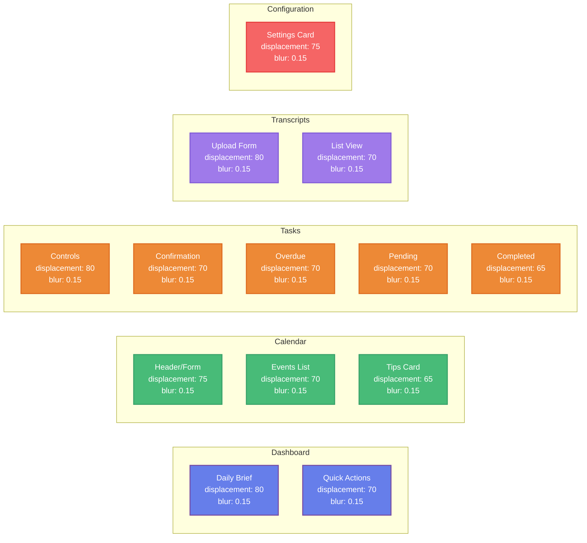
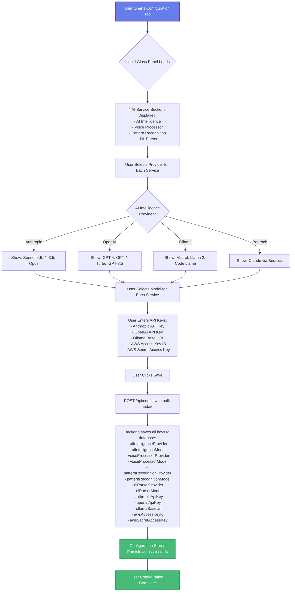
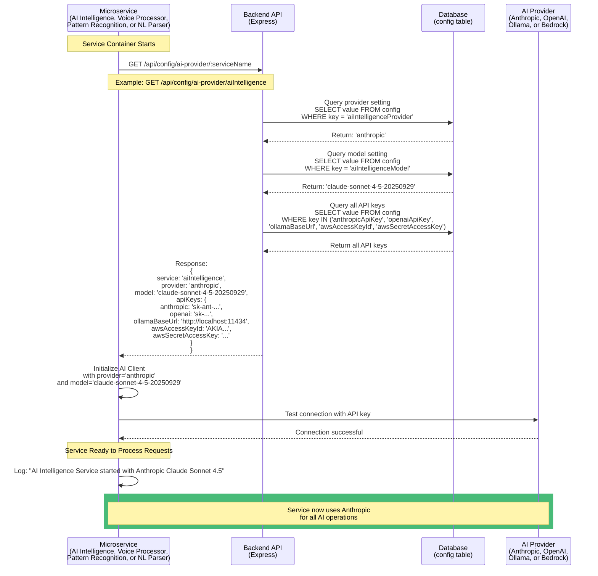
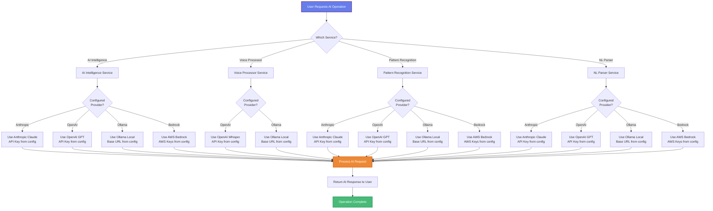
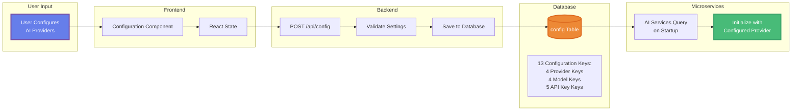
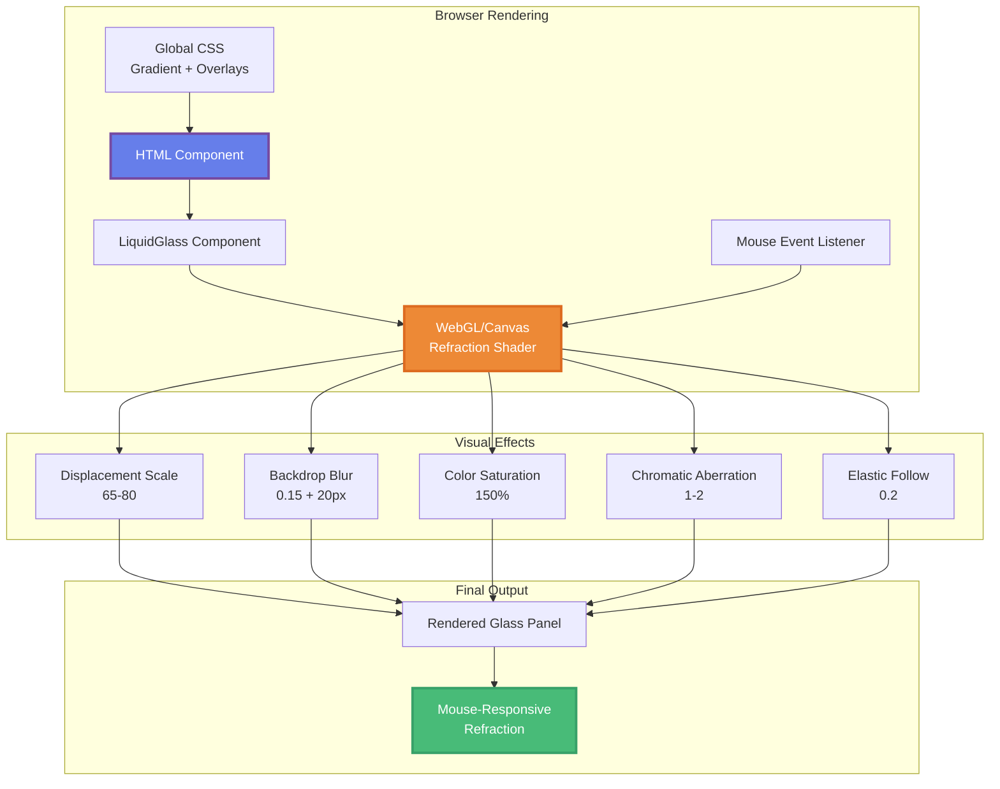

# AI Chief of Staff - Architecture & Application Flows

## Table of Contents
- [System Architecture](#system-architecture)
- [Liquid Glass UI Architecture](#liquid-glass-ui-architecture)
- [Multi-Provider AI Configuration](#multi-provider-ai-configuration)
- [Application Flows](#application-flows)
- [Data Flow Diagrams](#data-flow-diagrams)

---

## System Architecture

### High-Level System Architecture

```mermaid
graph TB
    subgraph "Frontend - React SPA"
        UI[Liquid Glass UI<br/>13 Glass Panels]
        D[Dashboard]
        C[Calendar]
        T[Tasks]
        TR[Transcripts]
        CF[Configuration]
        
        UI --> D
        UI --> C
        UI --> T
        UI --> TR
        UI --> CF
    end
    
    subgraph "Backend - Express API Gateway"
        API[Express Server<br/>Port 3001]
        ConfigMgr[Configuration Manager]
        Routes[API Routes]
        
        API --> Routes
        Routes --> ConfigMgr
    end
    
    subgraph "AI Services - Optional Microservices"
        AII[AI Intelligence<br/>Port 8001]
        VP[Voice Processor<br/>Port 8004]
        PR[Pattern Recognition<br/>Port 8002]
        NLP[NL Parser<br/>Port 8003]
        
        AII -.->|Query Config| API
        VP -.->|Query Config| API
        PR -.->|Query Config| API
        NLP -.->|Query Config| API
    end
    
    subgraph "AI Providers"
        Anthropic[Anthropic Claude<br/>Sonnet 4.5, 4, 3.5]
        OpenAI[OpenAI<br/>GPT-4, Whisper]
        Ollama[Ollama Local<br/>Mistral, Llama]
        Bedrock[AWS Bedrock<br/>Claude via AWS]
    end
    
    subgraph "Storage"
        DB[(Database<br/>SQLite/PostgreSQL)]
        ConfigFile[/app/data/config.json]
    end
    
    UI -->|REST API| API
    ConfigMgr --> DB
    ConfigMgr --> ConfigFile
    
    AII -->|Configured Provider| Anthropic
    AII -->|Configured Provider| OpenAI
    AII -->|Configured Provider| Ollama
    AII -->|Configured Provider| Bedrock
    
    VP -->|Configured Provider| OpenAI
    VP -->|Configured Provider| Ollama
    
    PR -->|Configured Provider| Anthropic
    PR -->|Configured Provider| OpenAI
    PR -->|Configured Provider| Ollama
    PR -->|Configured Provider| Bedrock
    
    NLP -->|Configured Provider| Anthropic
    NLP -->|Configured Provider| OpenAI
    NLP -->|Configured Provider| Ollama
    NLP -->|Configured Provider| Bedrock
    
    style UI fill:#667eea,stroke:#764ba2,stroke-width:3px,color:#fff
    style API fill:#48bb78,stroke:#38a169,stroke-width:3px,color:#fff
    style DB fill:#ed8936,stroke:#dd6b20,stroke-width:3px,color:#fff
```

---

## Liquid Glass UI Architecture

### Component Structure with Glass Panels



### Liquid Glass Technical Details

**Background System:**
```css
/* Base gradient (3 colors) */
background: linear-gradient(135deg, 
    #0a0a0f 0%,   /* Dark blue-black */
    #1a1a2e 50%,  /* Deep navy */
    #16213e 100%  /* Rich dark blue */
);
background-attachment: fixed; /* Parallax effect */

/* Depth overlays (2 radial gradients) */
radial-gradient(circle at 20% 30%, rgba(59, 130, 246, 0.08) 0%, transparent 50%),  /* Blue overlay */
radial-gradient(circle at 80% 70%, rgba(168, 85, 247, 0.08) 0%, transparent 50%)  /* Purple overlay */
```

**LiquidGlass Component Props:**
```javascript
<LiquidGlass
  displacementScale={65-80}        // Refraction intensity
  blurAmount={0.15}                // Backdrop blur level
  saturation={150}                 // Color saturation boost
  aberrationIntensity={1-2}        // Chromatic aberration
  elasticity={0.2}                 // Liquid follow behavior
  cornerRadius={16}                // Border radius (px)
  mouseContainer={containerRef}    // Mouse tracking area
  padding="0"                      // Use card padding
>
  <div style={{
    background: 'rgba(24, 24, 27, 0.4)',  // Semi-transparent
    backdropFilter: 'blur(20px)'           // Backdrop blur
  }}>
    {/* Card content */}
  </div>
</LiquidGlass>
```

**13 Glass Panels Distribution:**
- Dashboard: 2 panels (Daily Brief, Quick Actions)
- Calendar: 3 panels (Header/Form, Events List, Tips)
- Tasks: 5 panels (Controls, Confirmation, Overdue, Pending, Completed)
- Transcripts: 2 panels (Upload Form, List View)
- Configuration: 1 panel (Settings Card)

---

## Multi-Provider AI Configuration

### Configuration Architecture

```mermaid
graph TB
    subgraph "Frontend Configuration UI"
        UI[Configuration Tab]
        AII_UI[AI Intelligence Dropdowns]
        VP_UI[Voice Processor Dropdowns]
        PR_UI[Pattern Recognition Dropdowns]
        NLP_UI[NL Parser Dropdowns]
        Keys[API Keys Section]
        
        UI --> AII_UI
        UI --> VP_UI
        UI --> PR_UI
        UI --> NLP_UI
        UI --> Keys
    end
    
    subgraph "Backend API"
        SaveAPI[POST /api/config<br/>Save Configuration]
        GetAPI[GET /api/config/ai-provider/:service<br/>Get Service Config]
        ConfigMgr[Configuration Manager<br/>getAIProviderConfig()]
    end
    
    subgraph "Storage Layer"
        DB[(Database config Table)]
        ConfigKeys[Provider Keys:<br/>aiIntelligenceProvider<br/>aiIntelligenceModel<br/>voiceProcessorProvider<br/>voiceProcessorModel<br/>patternRecognitionProvider<br/>patternRecognitionModel<br/>nlParserProvider<br/>nlParserModel<br/>anthropicApiKey<br/>openaiApiKey<br/>ollamaBaseUrl<br/>awsAccessKeyId<br/>awsSecretAccessKey]
    end
    
    subgraph "Microservices"
        MS1[AI Intelligence<br/>Startup]
        MS2[Voice Processor<br/>Startup]
        MS3[Pattern Recognition<br/>Startup]
        MS4[NL Parser<br/>Startup]
    end
    
    UI -->|Save Settings| SaveAPI
    SaveAPI --> DB
    
    MS1 -->|Query Config| GetAPI
    MS2 -->|Query Config| GetAPI
    MS3 -->|Query Config| GetAPI
    MS4 -->|Query Config| GetAPI
    
    GetAPI --> ConfigMgr
    ConfigMgr --> DB
    
    GetAPI -->|Return Provider,<br/>Model, API Keys| MS1
    GetAPI -->|Return Provider,<br/>Model, API Keys| MS2
    GetAPI -->|Return Provider,<br/>Model, API Keys| MS3
    GetAPI -->|Return Provider,<br/>Model, API Keys| MS4
    
    style UI fill:#667eea,stroke:#764ba2,stroke-width:3px,color:#fff
    style DB fill:#ed8936,stroke:#dd6b20,stroke-width:3px,color:#fff
    style GetAPI fill:#48bb78,stroke:#38a169,stroke-width:3px,color:#fff
```

### Provider Selection Matrix

| Service | Anthropic | OpenAI | Ollama | AWS Bedrock |
|---------|-----------|--------|--------|-------------|
| **AI Intelligence** | ✅ Claude Sonnet 4.5, 4, 3.5, 3 Opus | ✅ GPT-4, GPT-4 Turbo, GPT-3.5 | ✅ Mistral, Llama 2, Code Llama | ✅ Claude via Bedrock |
| **Voice Processor** | ❌ | ✅ Whisper-1 (recommended) | ✅ Speech models | ❌ |
| **Pattern Recognition** | ✅ Claude Sonnet 4.5, 4, 3.5, 3 Opus | ✅ GPT-4, GPT-4 Turbo, GPT-3.5 | ✅ Mistral, Llama 2, Code Llama | ✅ Claude via Bedrock |
| **NL Parser** | ✅ Claude Sonnet 4.5, 4, 3.5, 3 Opus | ✅ GPT-4, GPT-4 Turbo, GPT-3.5 | ✅ Mistral, Llama 2, Code Llama | ✅ Claude via Bedrock |

---

## Application Flows

### 1. User Configuration Flow



### 2. Microservice Startup Flow



### 3. AI Provider Request Flow



### 4. Liquid Glass UI Rendering Flow

```mermaid
flowchart TD
    Start[User Opens Application] --> LoadCSS[Load Global CSS:<br/>- Gradient background<br/>- Radial overlays<br/>- Fixed attachment]
    
    LoadCSS --> LoadComponent[Component Loads<br/>Dashboard, Calendar, Tasks,<br/>Transcripts, or Configuration]
    
    LoadComponent --> CreateRef[Create containerRef<br/>for mouse tracking]
    
    CreateRef --> RenderGlass[Render LiquidGlass Components]
    
    RenderGlass --> Panel1[Glass Panel 1<br/>displacement: 80<br/>blur: 0.15<br/>saturation: 150]
    
    RenderGlass --> Panel2[Glass Panel 2<br/>displacement: 70<br/>blur: 0.15<br/>saturation: 150]
    
    RenderGlass --> PanelN[Glass Panel N<br/>displacement: 65<br/>blur: 0.15<br/>saturation: 150]
    
    Panel1 --> ApplyStyles[Apply Card Styles:<br/>- background: rgba(24,24,27,0.4)<br/>- backdropFilter: blur(20px)]
    Panel2 --> ApplyStyles
    PanelN --> ApplyStyles
    
    ApplyStyles --> TrackMouse{User Moves Mouse?}
    
    TrackMouse -->|Yes| Refract[Apply Refraction Effect:<br/>- Displacement based on mouse position<br/>- Chromatic aberration<br/>- Elastic follow behavior]
    
    TrackMouse -->|No| Static[Display Static Glass Effect]
    
    Refract --> Render[Render with Liquid Glass Effect]
    Static --> Render
    
    Render --> Beautiful[Beautiful Apple-Style UI<br/>with Mouse-Responsive Glass]
    
    Beautiful --> End[User Interacts with Glass Panels]
    
    style Start fill:#667eea,stroke:#764ba2,stroke-width:3px,color:#fff
    style Beautiful fill:#48bb78,stroke:#38a169,stroke-width:3px,color:#fff
    style End fill:#48bb78,stroke:#38a169,stroke-width:3px,color:#fff
```

---

## Data Flow Diagrams

### Configuration Data Flow



### Liquid Glass Rendering Pipeline



---

## Database Schema - Configuration Table

```sql
-- Configuration table stores all AI provider settings
CREATE TABLE IF NOT EXISTS config (
  key TEXT PRIMARY KEY,
  value TEXT NOT NULL,
  created_at DATETIME DEFAULT CURRENT_TIMESTAMP,
  updated_at DATETIME DEFAULT CURRENT_TIMESTAMP
);

-- Per-Service Provider Configuration (4 services × 2 settings = 8 keys)
INSERT OR REPLACE INTO config (key, value) VALUES
  ('aiIntelligenceProvider', 'anthropic'),
  ('aiIntelligenceModel', 'claude-sonnet-4-5-20250929'),
  ('voiceProcessorProvider', 'openai'),
  ('voiceProcessorModel', 'whisper-1'),
  ('patternRecognitionProvider', 'anthropic'),
  ('patternRecognitionModel', 'claude-sonnet-4-5-20250929'),
  ('nlParserProvider', 'openai'),
  ('nlParserModel', 'gpt-4'),
  
  -- API Keys (5 keys)
  ('anthropicApiKey', 'sk-ant-...'),
  ('openaiApiKey', 'sk-...'),
  ('ollamaBaseUrl', 'http://localhost:11434'),
  ('awsAccessKeyId', 'AKIA...'),
  ('awsSecretAccessKey', '...');
```

---

## API Endpoints

### Configuration Endpoints

**Get Service-Specific AI Configuration**
```http
GET /api/config/ai-provider/:serviceName

Parameters:
  - serviceName: aiIntelligence | voiceProcessor | patternRecognition | nlParser

Response:
{
  "service": "aiIntelligence",
  "provider": "anthropic",
  "model": "claude-sonnet-4-5-20250929",
  "apiKeys": {
    "anthropic": "sk-ant-...",
    "openai": "sk-...",
    "ollamaBaseUrl": "http://localhost:11434",
    "awsAccessKeyId": "AKIA...",
    "awsSecretAccessKey": "..."
  }
}
```

**Save Configuration**
```http
POST /api/config

Body:
{
  "aiIntelligenceProvider": "anthropic",
  "aiIntelligenceModel": "claude-sonnet-4-5-20250929",
  "voiceProcessorProvider": "openai",
  "voiceProcessorModel": "whisper-1",
  "patternRecognitionProvider": "ollama",
  "patternRecognitionModel": "mistral:latest",
  "nlParserProvider": "openai",
  "nlParserModel": "gpt-4",
  "anthropicApiKey": "sk-ant-...",
  "openaiApiKey": "sk-...",
  "ollamaBaseUrl": "http://localhost:11434"
}

Response:
{
  "message": "Configuration saved successfully"
}
```

---

## Benefits of Multi-Provider Architecture

### Cost Optimization
- **High-Volume Tasks**: Use free local Ollama models
- **Specialized Tasks**: Pay for OpenAI Whisper only when needed
- **Reasoning Tasks**: Use premium Anthropic Claude Sonnet 4.5

### Performance Tuning
- **Voice Transcription**: OpenAI Whisper (specialized)
- **Pattern Detection**: Claude Sonnet 4.5 (best reasoning)
- **Quick Parsing**: Ollama Mistral (fast, local)
- **Natural Language**: GPT-4 (excellent NLU)

### Privacy & Security
- **Sensitive Data**: Keep on local Ollama models
- **Compliance**: Certain data never leaves infrastructure
- **Audit Trail**: Track which provider processed each request

### Redundancy & Reliability
- **Provider Outages**: Switch to backup provider
- **Rate Limits**: Distribute load across providers
- **Regional Issues**: Use AWS Bedrock as alternative

---

## Component Dependencies

### NPM Package: liquid-glass-react

**Installation:**
```bash
npm install liquid-glass-react@^0.0.15
```

**Usage:**
```javascript
import LiquidGlass from 'liquid-glass-react';

<LiquidGlass
  displacementScale={80}
  blurAmount={0.15}
  saturation={150}
  aberrationIntensity={2}
  elasticity={0.2}
  cornerRadius={16}
  mouseContainer={containerRef}
  padding="0"
>
  <div className="card glass-card">
    {/* Content */}
  </div>
</LiquidGlass>
```

**Credit:** Created by rdev - https://github.com/rdev/liquid-glass-react

---

## Migration Notes

### From Single Provider to Multi-Provider

**Before (v1.0.0):**
- Single `anthropicApiKey` in config
- All services use Anthropic Claude
- No per-service configuration

**After (v1.1.0):**
- Per-service provider selection
- Multiple API keys supported
- Database-backed configuration
- Backward compatible (defaults to Anthropic)

**Migration Steps:**
1. Existing `anthropicApiKey` still works for main app
2. New microservices query `/api/config/ai-provider/:service`
3. If no service-specific config found, falls back to default (Anthropic)
4. User can configure each service independently in UI

---

## Troubleshooting

### Liquid Glass Not Visible
1. Check browser console for errors
2. Verify `liquid-glass-react` package installed
3. Ensure containerRef is created: `const containerRef = useRef(null)`
4. Check background gradient is applied in `index.css`

### Microservice Can't Query Configuration
1. Verify endpoint: `GET /api/config/ai-provider/:serviceName`
2. Check service name is valid: `aiIntelligence`, `voiceProcessor`, `patternRecognition`, `nlParser`
3. Ensure database has configuration keys
4. Check backend logs for connection errors

### Provider API Errors
1. Verify API key is correct in Configuration tab
2. Check provider is available (Ollama running locally?)
3. Test connection with curl: `curl http://localhost:11434/api/tags` (Ollama)
4. Check rate limits for OpenAI/Anthropic

---

**This architecture enables flexible, cost-effective, and privacy-conscious AI operations!**
