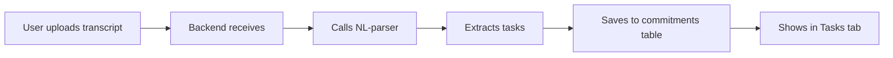
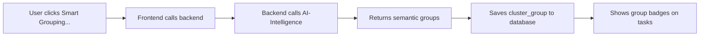
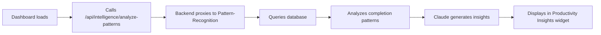
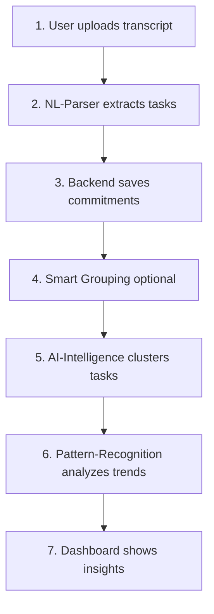
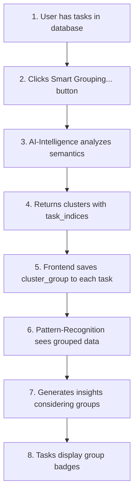

# Microservices Integration Guide

## Overview

The AI Chief of Staff uses a microservices architecture where specialized services work together to provide intelligent task management.

## Service Responsibilities

### 1. **NL-Parser** (Natural Language Parser)
**Port:** 8003  
**When Used:** Automatically during transcript processing

**Purpose:**
- Extracts structured commitments from meeting transcripts
- Parses natural language to identify tasks, deadlines, and assignees
- Converts freeform text into actionable items

**Triggered By:**
- **POST /api/transcripts/upload** - When you upload meeting notes/transcripts
- **POST /api/transcripts/upload-text** - When you paste text directly
- Backend automatically calls NL-parser to extract tasks from the content

**Example Flow:**


### 2. **AI-Intelligence** (Task Analysis)
**Port:** 8001  
**When Used:** On-demand via UI actions

**Purpose:**
- Estimates task effort and complexity
- Classifies energy levels (creative vs administrative)
- Clusters related tasks into smart groups

**Triggered By:**
- **Smart Grouping button** in Tasks tab → Clusters pending tasks
- **Effort estimation** (future feature) → Analyzes task difficulty
- Backend brief generation → Optionally uses for prioritization

**Example Flow:**


### 3. **Pattern-Recognition** (Behavioral Insights)
**Port:** 8002  
**When Used:** Automatically on Dashboard load

**Purpose:**
- Analyzes completion patterns over time
- Detects productivity trends and working preferences
- Generates actionable insights with AI

**Triggered By:**
- **Dashboard load** → Fetches productivity insights widget
- **Pattern analysis endpoint** → POST /api/intelligence/analyze-patterns
- Uses last 7 days of completed tasks by default

**Data Sources:**
- Reads from `commitments` table (completed_date, deadline, cluster_group)
- Considers both individual task data and smart group assignments
- Generates AI insights about working patterns

**Example Flow:**


### 4. **Voice-Processor** (Transcription)
**Port:** 8004  
**When Used:** When uploading audio files (future)

**Purpose:**
- Converts audio/video to text using Whisper
- Stores recordings persistently
- Supports local and S3 storage

**Triggered By:**
- Audio file uploads (when feature is enabled)
- Integrates with Plaud Note recorder

### 5. **Context-Service** (Fast Retrieval)
**Port:** 8005  
**When Used:** For high-performance context queries

**Purpose:**
- Written in Go for speed
- Fast retrieval of recent context
- Optimized for rolling 2-week window queries

## How They Work Together

### Transcript Processing Flow


### Smart Grouping Integration


### Pattern Analysis with Groups
When smart grouping is active:
- Pattern-Recognition queries include `cluster_group` field
- Insights consider group-level patterns (e.g., "Most productive in Development tasks")
- AI generates recommendations based on cluster performance
- Completion rates shown per group

## Database Integration

All services read/write to shared PostgreSQL database:

**Commitments Table:**
- `cluster_group TEXT` - Smart group assignment
- `status TEXT` - pending/completed
- `deadline TEXT` - ISO timestamp
- `created_date TIMESTAMP` - When task was created
- `completed_date TIMESTAMP` - When task was finished

**Pattern Analysis Queries:**
```sql
-- Get tasks by group
SELECT * FROM commitments 
WHERE cluster_group = 'Project Name' 
AND completed_date >= NOW() - INTERVAL '7 days';

-- Completion rate by group
SELECT cluster_group, 
       COUNT(*) as total,
       COUNT(completed_date) as completed
FROM commitments 
GROUP BY cluster_group;
```

## External Integrations

**When tasks have cluster_group:**
- Jira issues: Added as label
- Microsoft Planner: Added as bucket/category
- Google Calendar: Added to event description
- Helps organize external tools by AI-detected themes

## Benefits of Integration

1. **Automatic Task Extraction** - NL-parser converts meeting notes to tasks
2. **Semantic Grouping** - AI-Intelligence finds related work
3. **Persistent Groups** - cluster_group field keeps assignments
4. **Pattern Recognition** - Analyzes how you work within groups
5. **Actionable Insights** - AI provides group-specific recommendations
6. **External Sync** - Groups propagate to Jira/Planner/Calendar

## Troubleshooting

**Pattern analysis shows "Complete some tasks to see analysis":**
- Need at least 1 completed task in last 7 days
- Check `completed_date` is set when marking tasks complete
- Verify Pattern-Recognition service is running: `docker logs aicos-pattern-recognition`

**Smart grouping not saving:**
- Check cluster_group column exists: `docker-compose down && docker-compose up -d`
- Migration runs automatically on startup
- Verify backend logs show no errors

**NL-parser not extracting tasks:**
- Check service is running: `docker logs aicos-nl-parser`
- Verify ANTHROPIC_API_KEY is set
- Try simpler transcript format (clear "I will..." or "We need to..." statements)

## Performance Optimization

**Current Settings:**
- AI-Intelligence: max_tokens=1024 (clustering)
- Pattern-Recognition: max_tokens=1024 (insights)
- Temperature: 0.4-0.7 for balance of creativity and focus
- Cache: Redis caching for 30min (pattern results)

**Resource Limits:**
```yaml
ai-intelligence: 2 CPU / 2GB RAM
pattern-recognition: 2 CPU / 4GB RAM  
nl-parser: 1 CPU / 2GB RAM
```

Adjust in `docker-compose.microservices.yml` under `deploy.resources`.
